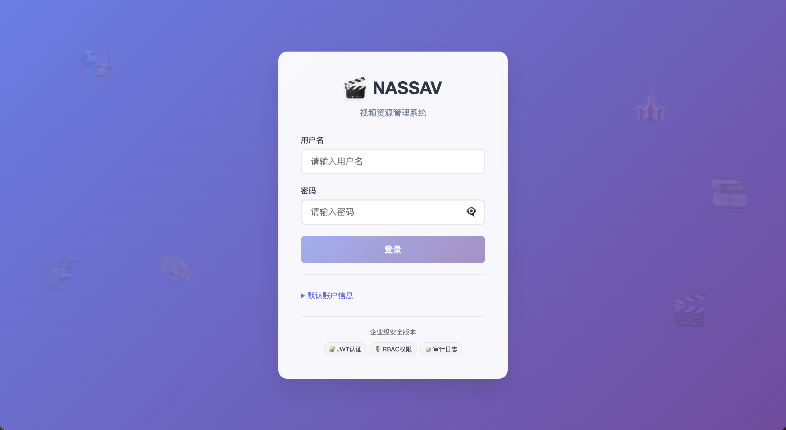
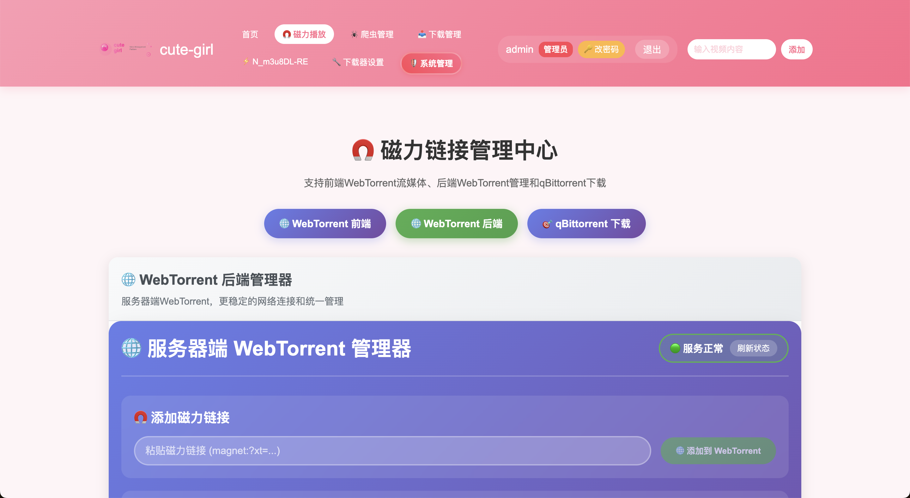
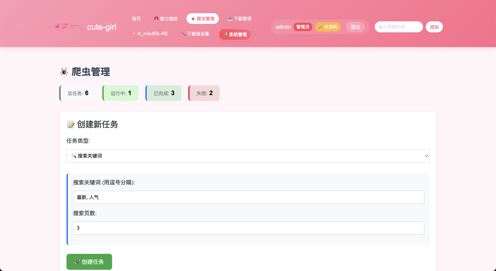
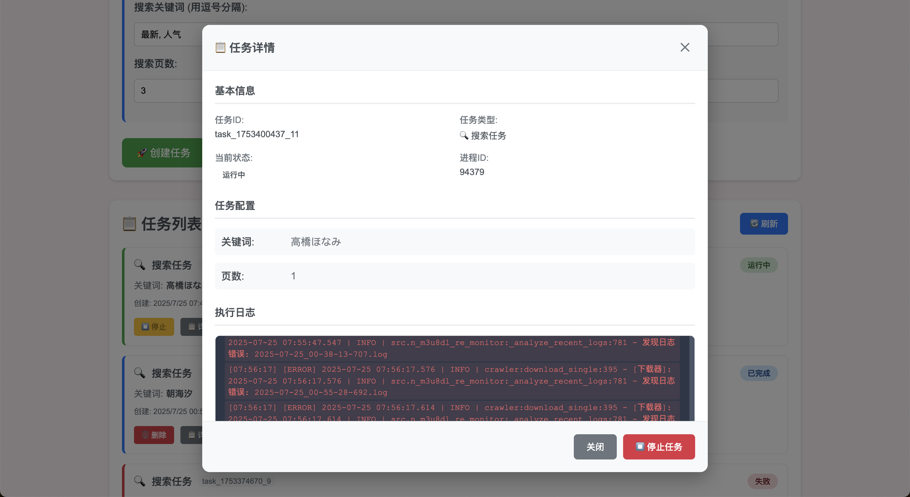
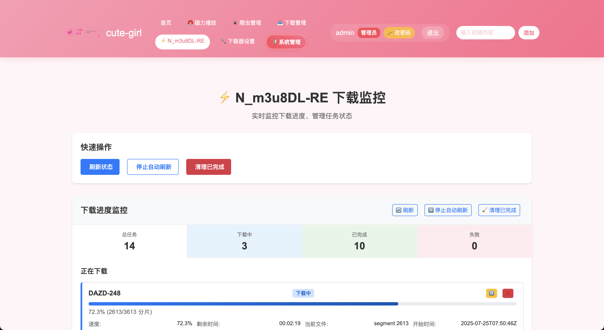
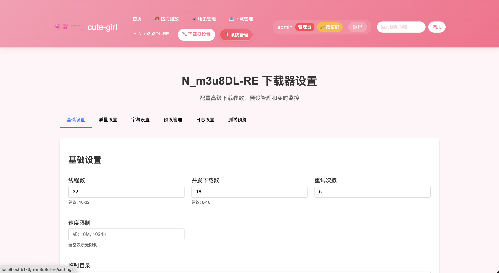
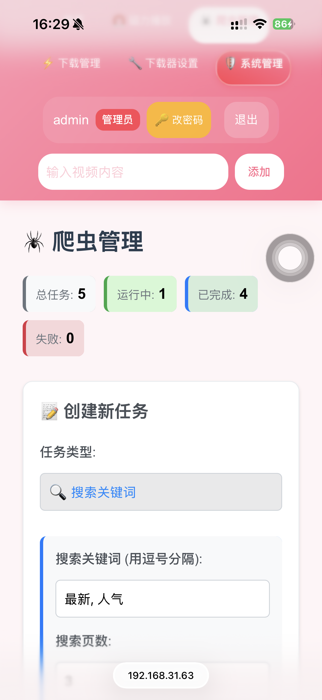

# CuteGirl
<div align="center">

<br>
</div>

<div align="center">
  
</div>

## 项目简介

CuteGirl 是一个基于 Python 开发的多源影视资源下载管理工具，支持从多个数据源自动下载、整理和刮削影视资源。

项目采用模块化设计，支持自定义下载器，并提供了完整的元数据管理功能和配套服务。

## 核心特性

- 🎥 多源下载支持：支持 MissAV、Jable、HohoJ、Memo （持续添加中）等多个数据源
- 📝 智能元数据管理：从JavBus自动获取影片信息、封面、海报等元数据
- 🔄 队列管理：支持批量下载任务管理。使用sqlite去重，防止重复下载
- 🌐 远程控制：提供 HTTP API 接口，支持远程控制下载任务
- 🔒 文件锁机制：确保同一时间只有一个下载任务运行
- 🎨 媒体服务器兼容：自动生成 NFO 文件，支持主流媒体服务器
## 系统预览(WEB)







## 系统预览（手机）

## Jellyfin预览


# NASSAV Docker 部署指南

## 概述

NASSAV 提供完整的 Docker 容器化部署方案，支持一键部署所有服务。

## 架构

```
┌─────────────────┐    ┌─────────────────┐    ┌─────────────────┐
│   Frontend      │    │    Backend      │    │   Downloader    │
│  (Vue.js)       │◄───┤   (Go API)      │◄───┤  (Python)       │
│  Port: 80       │    │  Port: 31471    │    │                 │
└─────────────────┘    └─────────────────┘    └─────────────────┘
         │                       │                       │
         │                       │                       │
         │              ┌─────────────────┐              │
         │              │   MissAV API    │              │
         └──────────────┤  (FastAPI)      │◄─────────────┘
                        │  Port: 8000     │
                        └─────────────────┘
                                 │
                    ┌─────────────────┐
                    │  qBittorrent    │
                    │  Port: 8080     │
                    └─────────────────┘
```

## 快速开始

### 1. 系统要求

- Docker >= 20.10
- Docker Compose >= 2.0
- 至少 4GB 可用内存
- 至少 10GB 可用磁盘空间

### 2. 一键部署

```bash
# 克隆项目（如果还没有）
git clone <项目地址>
cd NASSAV

# 启动所有服务
./docker-start.sh
```

### 3. 手动部署

```bash
# 创建数据目录
mkdir -p data/{movie,db,qbittorrent/config} logs

# 启动服务
docker-compose up -d

# 查看服务状态
docker-compose ps

# 查看日志
docker-compose logs -f
```

## 服务访问

| 服务 | 地址 | 说明 |
|------|------|------|
| 前端界面 | http://localhost | 主要界面 |
| 后端API | http://localhost:31471 | REST API |
| MissAV API | http://localhost:8000 | 第三方 API |
| API 文档 | http://localhost:8000/docs | FastAPI 文档 |
| qBittorrent | http://localhost:8080 | 种子管理 |

### 默认账户

- **qBittorrent**: admin / adminpass

## 目录结构

```
cute-girl/
├── docker-compose.yml          # 开发环境配置
├── docker-compose.prod.yml     # 生产环境配置
├── docker-start.sh             # 启动脚本
├── docker-build.sh             # 镜像构建脚本
├── docker-init.sh              # 环境初始化脚本
├── docker-health-check.sh      # 健康检查脚本
├── .env.docker                 # 环境变量
├── data/                       # 数据目录
│   ├── movie/                  # 视频文件
│   ├── db/                     # 数据库文件
│   └── qbittorrent/            # qBittorrent 配置
├── logs/                       # 日志目录
├── Dockerfile                  # 主项目镜像 (优化版)
├── .dockerignore              # Docker忽略文件
├── backend/Dockerfile          # Go 后端
├── frontend/Dockerfile         # Vue 前端
└── MissAV-API/Dockerfile      # MissAV API
```

## 📦 镜像架构优化

### 自包含镜像设计
- **主下载器**: `nassav/downloader` - 完整打包Python代码、依赖工具和默认配置
- **Go后端**: `nassav/backend` - 独立API服务器
- **Vue前端**: `nassav/frontend` - 静态文件服务  
- **MissAV API**: `nassav/missav-api` - 第三方API服务

### 优化的挂载策略
- **数据持久化**: `/data/movie` (视频), `/app/db` (数据库), `/app/logs` (日志)
- **配置覆盖**: 只挂载 `configs.json` 覆盖镜像内默认配置
- **代码内置**: 所有源码、工具、依赖都打包到镜像，无需挂载源码目录
- **减少依赖**: 消除了对宿主机源码的依赖，提高部署一致性

## 配置说明

### 环境变量 (.env.docker)

```bash
# 数据路径
DATA_PATH=./data
MOVIE_PATH=./data/movie
DB_PATH=./data/db

# 服务端口
BACKEND_PORT=31471
FRONTEND_PORT=80
QBITTORRENT_PORT=8080

# qBittorrent 账户
QB_USERNAME=admin
QB_PASSWORD=adminpass
```

### 数据卷映射

| 容器路径 | 宿主路径 | 说明 |
|----------|----------|------|
| `/data/movie` | `./data/movie` | 视频下载目录 |
| `/app/db` | `./data/db` | 数据库文件 |
| `/app/logs` | `./logs` | 应用日志 |
| `/config` | `./data/qbittorrent/config` | qBittorrent 配置 |

## 生产环境部署

### 1. 使用生产配置

```bash
# 使用生产环境配置
docker-compose -f docker-compose.prod.yml up -d

# 或指定数据目录
DATA_PATH=/opt/nassav/data docker-compose -f docker-compose.prod.yml up -d
```

### 2. 持久化数据

```bash
# 创建 Docker 卷
docker volume create nassav_movie_data
docker volume create nassav_db_data

# 修改 docker-compose.prod.yml 中的卷映射
```

### 3. SSL/HTTPS 配置

```bash
# 创建 SSL 证书目录
mkdir -p nginx/ssl

# 放置证书文件
cp your-cert.pem nginx/ssl/
cp your-key.pem nginx/ssl/

# 更新 nginx 配置以启用 HTTPS
```

## 常用命令

### 服务管理

```bash
# 启动所有服务
docker-compose up -d

# 停止所有服务
docker-compose down

# 重启服务
docker-compose restart

# 查看服务状态
docker-compose ps

# 查看资源使用
docker stats
```

### 日志查看

```bash
# 查看所有日志
docker-compose logs -f

# 查看特定服务日志
docker-compose logs -f downloader
docker-compose logs -f backend
docker-compose logs -f frontend

# 查看最近的日志
docker-compose logs --tail=100 downloader
```

### 数据管理

```bash
# 备份数据
tar -czf nassav-backup-$(date +%Y%m%d).tar.gz data/

# 恢复数据
tar -xzf nassav-backup-20231201.tar.gz

# 清理未使用的镜像
docker system prune
```

### 镜像管理

```bash
# 构建所有镜像
./docker-build.sh

# 构建指定版本
./docker-build.sh v1.0.0

# 构建并推送到Registry
./docker-build.sh v1.0.0 your-registry.com

# 使用Makefile构建
make build-prod
```

## 故障排除

### 常见问题

1. **端口冲突**
   ```bash
   # 检查端口占用
   netstat -tlnp | grep :80
   netstat -tlnp | grep :31471
   
   # 修改端口映射
   vim docker-compose.yml
   ```

2. **权限问题**
   ```bash
   # 检查数据目录权限
   ls -la data/
   
   # 修复权限
   sudo chown -R $USER:$USER data/
   chmod -R 755 data/
   ```

3. **内存不足**
   ```bash
   # 查看内存使用
   docker stats
   
   # 限制容器内存
   # 在 docker-compose.yml 中添加:
   deploy:
     resources:
       limits:
         memory: 2G
   ```

4. **网络问题**
   ```bash
   # 检查容器网络
   docker network ls
   docker network inspect nassav_nassav-network
   
   # 重建网络
   docker-compose down
   docker network prune
   docker-compose up -d
   ```

### 调试模式

```bash
# 进入容器调试
docker-compose exec downloader /bin/bash
docker-compose exec backend /bin/sh

# 查看容器日志
docker logs nassav-downloader
docker logs nassav-backend

# 实时监控
watch docker-compose ps
```

## 升级指南

### 1. 备份数据

```bash
docker-compose down
tar -czf backup-$(date +%Y%m%d).tar.gz data/ logs/
```

### 2. 更新代码

```bash
git pull origin main
```

### 3. 重建镜像

```bash
docker-compose build --no-cache
docker-compose up -d
```

### 4. 验证升级

```bash
docker-compose ps
docker-compose logs -f
```

## 监控

### 健康检查

```bash
# 检查服务状态
curl http://localhost/api/videos
curl http://localhost:31471/api/downloads
```

### 日志监控

```bash
# 实时日志监控
docker-compose logs -f | grep -i error
```

### 资源监控

```bash
# 容器资源使用
docker stats --no-stream

# 磁盘使用
du -sh data/*
```

## 性能优化

1. **调整容器资源限制**
2. **使用 SSD 存储**
3. **调整并发下载数**
4. **启用日志轮转**

## 安全建议

1. **更改默认密码**
2. **使用防火墙限制端口访问**
3. **启用 HTTPS**
4. **定期备份数据**
5. **及时更新镜像**


## 系统要求

- **稳定的网络连接和代理服务**
- Python 3.11.2 或更高版本
- FFmpeg
- Go 1.22.6 或更高版本（仅用于编译 HTTP 服务器）

## 安装指南

1. 克隆项目并安装依赖：
```bash
git clone  https://github.com/gentlemen695/CuteGirl.git
pip3 install -r requirements.txt
```

2. 安装 FFmpeg：
```bash
sudo apt install ffmpeg
```

3. 配置项目：
   - 复制 `cfg/configs.json.example` 为 `cfg/configs.json`
   - 修改配置文件中的关键参数：
     - `SavePath`：设置视频保存路径
     - `Proxy`：配置代理服务器地址（如果不需要使用代理，设置成""即可）
     - `Downloader`：配置下载器及其优先级
     - `IsNeedVideoProxy`：下载视频是否使用代理

## 使用方法

### 基本使用

0. 初始化，修改配置文件。主要关注的字段：
    - SavePath：下载保存的位置
    - Proxy：http代理服务器url（如果不需要使用代理，设置成""即可）
    - IsNeedVideoProxy：下载视频是否使用代理
```json
{
    "LogPath": "./logs",
    "SavePath": "/vol2/1000/MissAV",
    "DBPath": "./db/downloaded.db",
    "QueuePath": "./db/download_queue.txt",
    "Proxy": "http://127.0.0.1:7897",
    "IsNeedVideoProxy": false,
}
```

1. 如果本地已有资源，需要先整理目录结构，车牌号大写作为文件夹名字，视频同名放在文件夹里面：

```
...
├── SVGAL-009
│   └── SVGAL-009.mp4
├── STCVS-007
│   └── STCVS-007.mp4
...
```
然后执行`python3 metadata.py`，爬取元数据。最后生成的目录结构：
```
...
├── SVGAL-009
│   ├── metadata.json
│   ├── SVGAL-009-fanart.jpg
│   ├── SVGAL-009.mp4
│   ├── SVGAL-009.nfo
│   └── SVGAL-009-poster.jpg
├── thumb
│   ├── JULIA.jpg
│   ├── ちゃんよた.jpg
│   ├── 七森莉莉.jpg
│   ├── 七泽米亚.jpg
...
```

2. 下载单个资源：
```bash
python3 main.py <车牌号>
```

3. 强制下载（忽略重复检查）：
```bash
python3 main.py <车牌号> -f
```

### 批量下载

1. 将车牌号添加到 `db/download_queue.txt` 中
2. 设置定时任务：
```bash
20 * * * * cd /path/to/NASSAV && bash cron_task.sh
```

### HTTP API 服务

1. 编译并启动 HTTP 服务器：
```bash
cd server
go build -o main
./main
```

2. 发送下载请求：
```bash
curl -X POST http://127.0.0.1:49530/process -d "车牌号"
```

### 前后端服务

刮削时下载了大量fanart，故提供一个网页预览。

后端提供了两个API：
1. 获取车牌号列表：/api/videos
2. 获取车牌号详细信息：/api/videos/FPRE-017

请求结果如下：
```
/api/videos
-----------------------------
[{"id":"ACHJ-057","title":"ACHJ-057 時には勝手に痴女りたい…。Madonna専属 究極美熟女『めぐり』お貸ししますー。","poster":"/file/ACHJ-057/ACHJ-057-poster.jpg"},{"id":"ADN-604","title":"ADN-604 お義父さんは私の事、どう思ってますか？ 七海ティナ","poster":"/file/ADN-604/ADN-604-poster.jpg"},{"id":"AGAV-122","title":"AGAV-122 顔で抜く！！顔面ドアップPOV 関西弁でイチャサド射精管理してくる年上彼女との同棲生活 流川莉央","poster":"/file/AGAV-122/AGAV-122-poster.jpg"},...]

/api/videos/FPRE-017
-----------------------------
{"id":"FPRE-017","title":"FPRE-017 爆乳セレブ痴女に見つめられて犯●れたい 菊乃らん","releaseDate":"2024-02-02","fanarts":["/file/FPRE-017/FPRE-017-fanart-1.jpg","/file/FPRE-017/FPRE-017-fanart-10.jpg","/file/FPRE-017/FPRE-017-fanart-11.jpg","/file/FPRE-017/FPRE-017-fanart-12.jpg","/file/FPRE-017/FPRE-017-fanart-13.jpg","/file/FPRE-017/FPRE-017-fanart-14.jpg","/file/FPRE-017/FPRE-017-fanart-15.jpg","/file/FPRE-017/FPRE-017-fanart-16.jpg","/file/FPRE-017/FPRE-017-fanart-17.jpg","/file/FPRE-017/FPRE-017-fanart-18.jpg","/file/FPRE-017/FPRE-017-fanart-19.jpg","/file/FPRE-017/FPRE-017-fanart-2.jpg","/file/FPRE-017/FPRE-017-fanart-20.jpg","/file/FPRE-017/FPRE-017-fanart-21.jpg","/file/FPRE-017/FPRE-017-fanart-3.jpg","/file/FPRE-017/FPRE-017-fanart-4.jpg","/file/FPRE-017/FPRE-017-fanart-5.jpg","/file/FPRE-017/FPRE-017-fanart-6.jpg","/file/FPRE-017/FPRE-017-fanart-7.jpg","/file/FPRE-017/FPRE-017-fanart-8.jpg","/file/FPRE-017/FPRE-017-fanart-9.jpg","/file/FPRE-017/FPRE-017-fanart.jpg"],"videoFile":"/file/FPRE-017/FPRE-017.mp4"}
```

据此使用Vue实现一个前端，预览list和detail。

list页：

detail页：


## 配置说明

### 下载器配置

在 `configs.json` 中可以配置多个下载源及其优先级：

```json
"Downloader": [
    {
        "downloaderName": "MissAV",
        "domain": "missav.ai",
        "weight": 300
    },
    {
        "downloaderName": "Jable",
        "domain": "jable.tv",
        "weight": 500
    },
    {
        "downloaderName": "HohoJ",
        "domain": "hohoj.tv",
        "weight": 0
    }
]
```

### 数据源说明

1. **MissAV**
   - 优点：资源全面，反爬限制较少
   - 缺点：清晰度一般（720p-1080p）

2. **Jable**
   - 优点：中文字幕资源多，清晰度高（1080p）
   - 缺点：反爬限制较严格

3. **HohoJ**
   - 优点：清晰度高（1080p），基本无反爬限制
   - 缺点：中文字幕资源较少

4. **Memo**
   - 优点：资源较新，更新及时
   - 缺点：部分资源需要会员


## 开发指南

### 添加新的下载器

1. 在 `src/downloader/` 目录下创建新的下载器类
2. 继承 `Downloader` 基类，实现必要的方法：
   - `getDownloaderName()`
   - `getHTML()`
   - `parseHTML()`
3. 在 `DownloaderMgr` 中注册新下载器
4. 在配置文件中添加相应的配置项

示例代码：
```python
class NewDownloader(Downloader):
    def getDownloaderName(self) -> str:
        return "NewDownloader"

    def getHTML(self, avid: str) -> Optional[str]:
        # 实现获取HTML的逻辑
        pass

    def parseHTML(self, html: str) -> Optional[AVDownloadInfo]:
        # 实现解析HTML的逻辑
        pass
```
### 有需求请自行fork修改，如果想要贡献代码发起PR即可


## 注意事项

- 使用本项目需要稳定的代理服务
- 请遵守相关法律法规，合理使用本工具
- 建议定期备份数据库文件
- 下载过程中请确保网络稳定
- 下载频率不要过高。否则会被cloudflare安排进贤者时间

## 许可证

本项目采用 MIT 许可证。详见 [LICENSE](LICENSE) 文件。 
